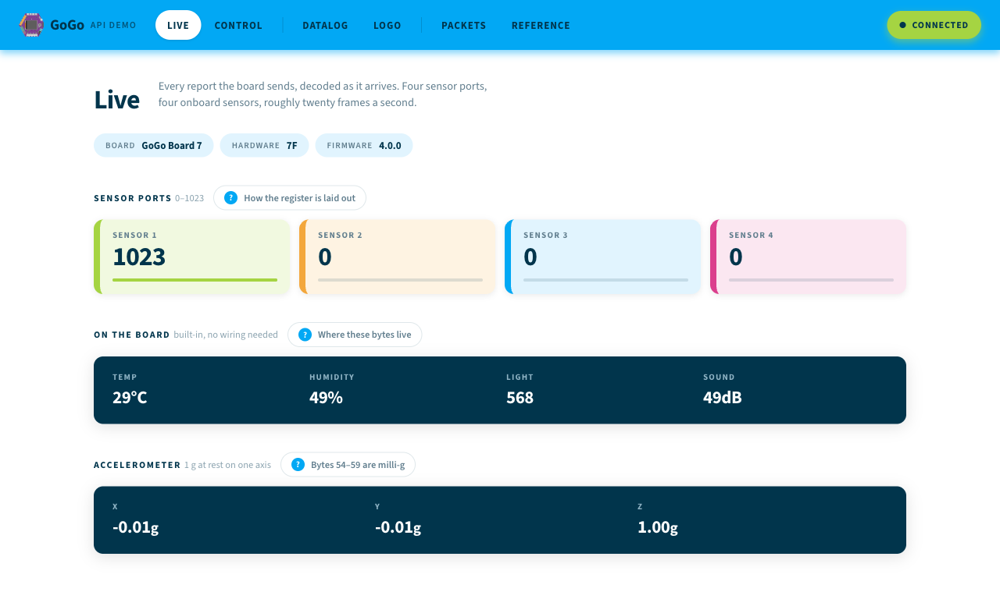
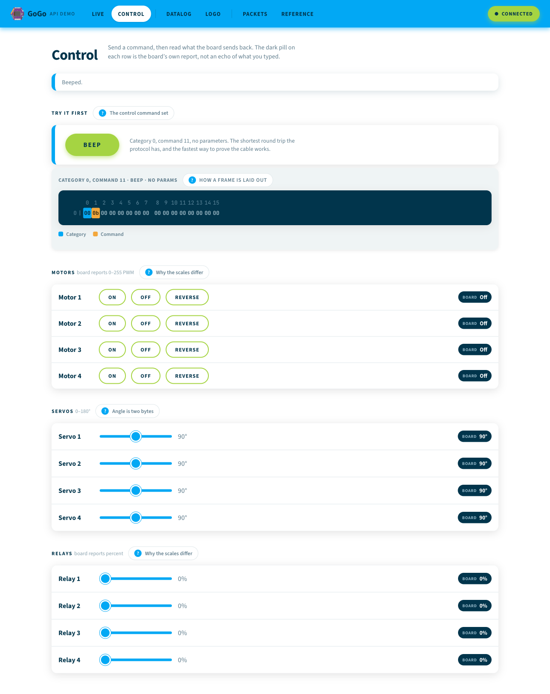
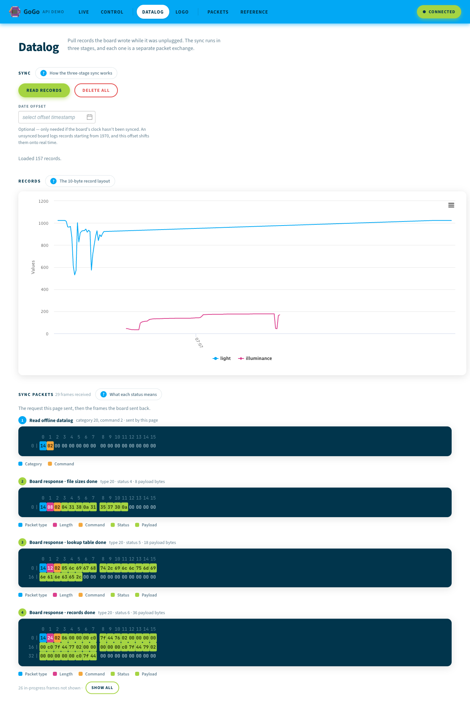
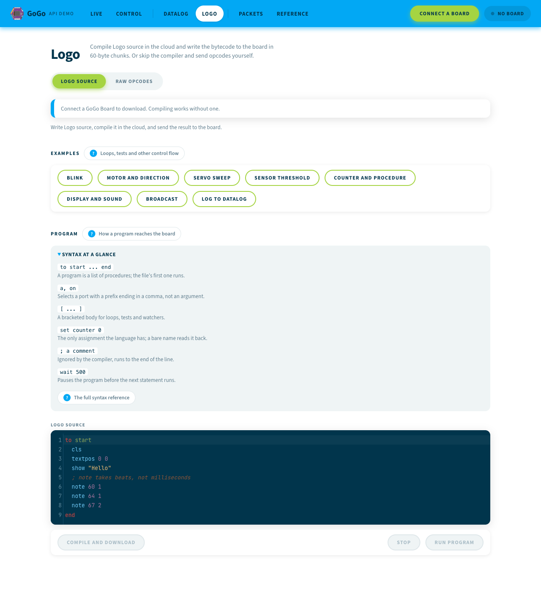
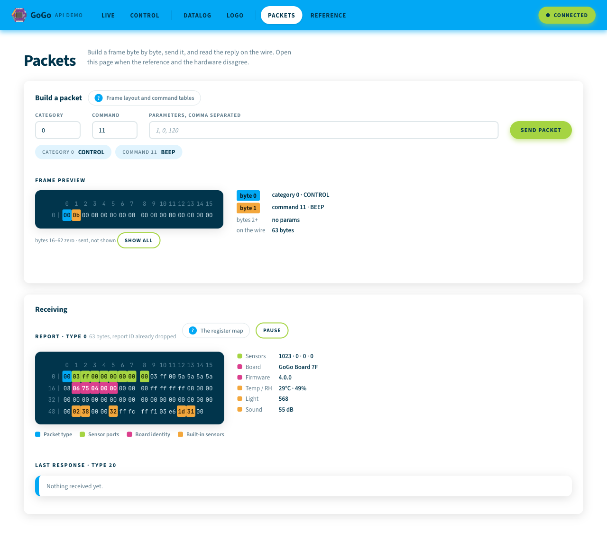
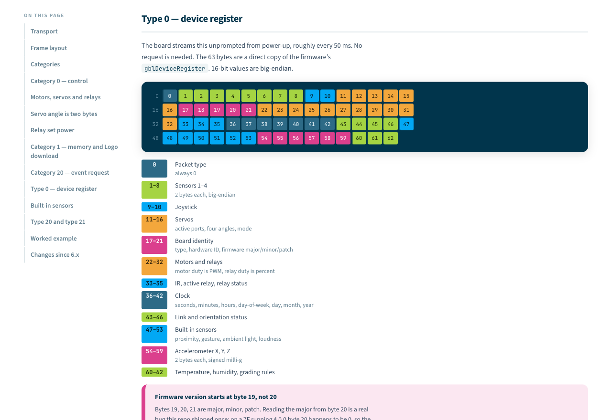

# GoGo API Demo

Reference webapp for talking to a GoGo Board from the browser. It is the playground where transport and protocol work gets prototyped before it ships in the [GoGoCode](https://code.gogoboard.org) webapp — `src/gogo/` is written framework-free so it can be copied there directly.

Six pages:

- **Live** (`/live`) — the streaming device register, rendered as sensor tiles
- **Control** (`/control`) — motors, servos, relays, beep
- **Datalog** (`/datalog`) — pull records off the board's flash and chart them
- **Logo** (`/logo`) — compile and download a Logo program, run or stop it, or push raw opcodes
- **Packets** (`/packets`) — build and send a raw command packet, inspect the last response
- **Reference** (`/reference`) — the wire protocol, datalog format and Logo language, in the app

Every page carries guide links next to its section headings that jump straight to the matching part of the reference, so you can dig into the bytes without leaving what you were testing.

## What it looks like

All captured against a physical GoGo Board 7F on firmware 4.0.0.

### Live

Sensor ports and the board's built-in sensors, decoded from the type-0 report the board streams about twenty times a second.



### Control

Motors, servos, relays and beep. The dark pill on each row is what the *board* reports back, not an echo of the slider. Every control shows the exact frame it put on the wire, inline under the thing you pressed.



### Datalog

Pulls records the board wrote while unplugged, charts them, and shows the staged transfer packet by packet.



### Logo

A CodeMirror editor with a real Logo mode, the compiler's bytecode, and the frames that carry it to the board in 60-byte chunks. Eight example programs, a syntax panel for the things you need before line one, and Run and Stop beside the download.



### Packets

Build a frame byte by byte and read the reply. Colour ties every decoded value on the right back to the bytes it came from.



### Reference

The wire protocol, datalog format and Logo language as pages in the app, reachable from the guide link beside any section you are testing.



## Copy what you need

`src/gogo/` has no Vue import and no dependency on this app's store or components — it is meant to be lifted wholesale into another project:

- `src/gogo/protocol.js` — packet framing, category/command/register constants, and the pure `build*`/`parse*` functions
- `src/gogo/transport.js` — `GogoTransport`, a small WebHID class wrapping connect/disconnect/send and an `on`/`off` event bus

Everything else in this repo (Vuex store, views, components) is a thin adapter around those two files.

## How it talks to the board

```
Web Application  <-- WebHID -->  GoGo Board
```

The browser opens the board's raw HID interface directly. No helper app, no driver.

Reading is unprompted: the board streams its device register from power-up. Writing is a 63-byte command packet per action. Downloading a Logo program is two steps — POST the source to the cloud compiler, then push the returned bytecode to the board in 60-byte chunks.

## Docs

**In the app** — byte maps, frame diagrams and worked examples, reachable from the guide link beside any section you are testing:

- [Wire protocol](https://lilcmu.github.io/gogo-api-demo/reference/protocol) — frame layout, command set, device register
- [Offline datalog](https://lilcmu.github.io/gogo-api-demo/reference/datalog) — the staged sync and the 10-byte record
- [Logo language](https://lilcmu.github.io/gogo-api-demo/reference/logo) — every command GoGo Board 7 runs, and what each returns

Standalone illustrated datasheets:

- [**Wire Protocol**](https://claude.ai/code/artifact/5adc8bd8-8799-4636-b508-db098818c737) — frame layout, command set, device register
- [**Offline Datalog Transfer**](https://claude.ai/code/artifact/5dceaae4-cce4-4823-8a7d-8dfb3b6f1f23) — the staged sync, decoded packet by packet

The same material in markdown, in this repo — authoritative, and what `src/reference/` is shaped from:

- [Protocol reference](docs/protocol.md) — packet framing, command tables, device register map
- [Offline datalog](docs/offline-datalog.md) — sync state machine and record format
- [Logo language](docs/logo-language.md) — the grammar, every command, and what firmware 3.2.6 actually runs

## Requirements

- **Chromium-based browser** — WebHID is not in Firefox or Safari
- **Node 20 or newer** — developed and verified on Node 24 LTS
- A GoGo Board over USB for anything device-facing

## Setup

```bash
npm install
npm run serve    # dev server, hot reload
npm test         # unit tests for src/gogo/
npm run lint     # eslint over src/
npm run build    # production build to dist/
```

## Deploying

Pushing to `master` deploys. `.github/workflows/deploy.yml` runs lint, tests and the production build, then publishes `dist/` to GitHub Pages — so a red test never reaches the live site. It can also be run by hand from the Actions tab.

There is no deploy script to run locally, and nothing pushes to the `gh-pages` branch any more; Pages serves the workflow's artifact directly.

No `NODE_OPTIONS` workaround is needed. The toolchain is Vue CLI 5 on webpack 5; `babel-loader` is pinned past 8.2.2 via an `overrides` entry because that version hashes with md4, which OpenSSL 3 removed.

Live demo: https://lilcmu.github.io/gogo-api-demo

## Status

Tracks **GoGo Board 7.x** throughout, verified against a physical 7F. What changed from the 6.x protocol is documented — see [Changes since 6.x](docs/protocol.md#changes-since-6x).

The Logo language reference targets firmware **3.2.6**, the current stable release; the bench board reports 4.0.0, which is a development build. Commands that need 4.0 are documented in a section of their own rather than mixed in, because on 3.2.6 they compile, download and stop the board.
